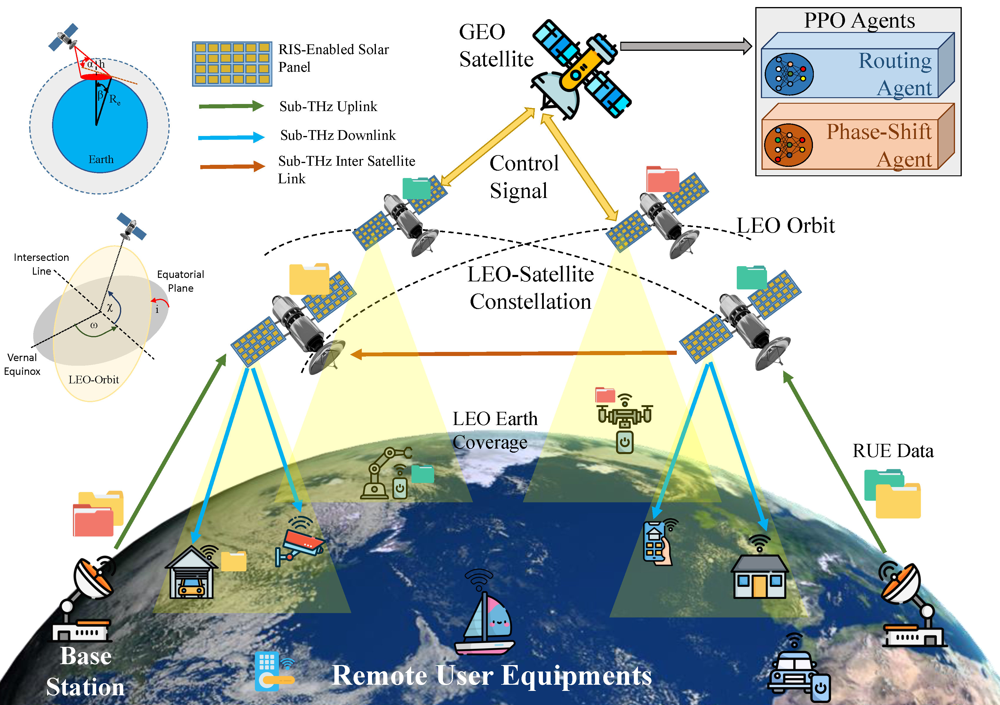
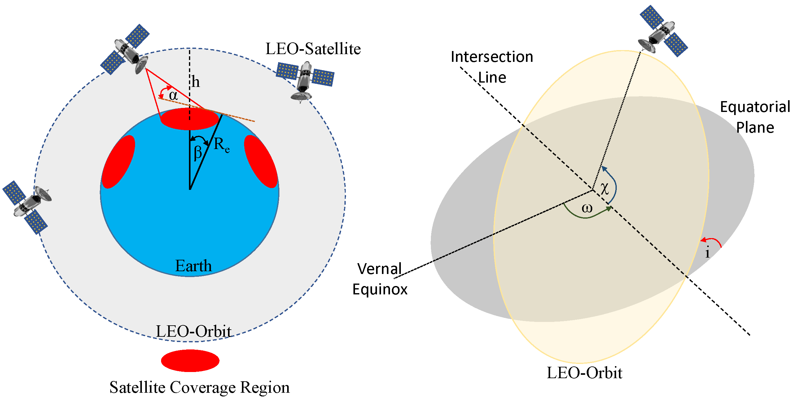
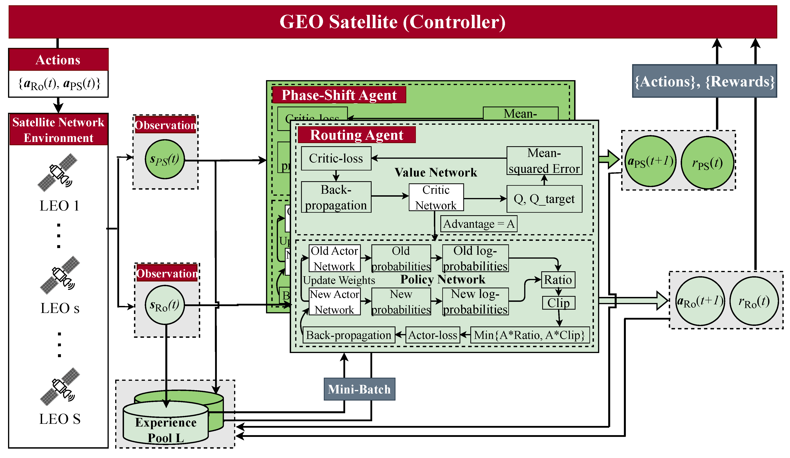

# SpaceRIS: LEO Satellite Coverage Maximization in 6G Sub-THz Networks by MAPPO DRL

## Overview
Satellite systems face a significant challenge in effectively utilizing limited communication resources to meet the demands of ground network traffic, characterized by asymmetrical spatial distribution and time-varying characteristics. Moreover, the coverage range and signal transmission distance of low Earth orbit (LEO) satellites are restricted by notable propagation attenuation, molecular absorption, and space losses in sub-terahertz (THz) frequencies. This paper introduces a novel approach to maximize LEO satellite coverage by leveraging reconfigurable intelligent surfaces (RISs) within 6G sub-THz networks. The optimization objectives encompass enhancing the end-to-end data rate, optimizing satellite-remote user equipment (RUE) associations, data packet routing within satellite constellations, RIS phase shift, and ground base station (GBS) transmit power (i.e., active beamforming). The formulated joint optimization problem poses significant challenges owing to its time-varying environment, non-convex characteristics, and NP-hard complexity. To address these challenges, we propose a block coordinate descent (BCD) algorithm that integrates balanced K-means clustering, multi-agent proximal policy optimization (MAPPO) deep reinforcement learning (DRL), and whale optimization (WOA) techniques. The performance of the proposed approach is demonstrated through comprehensive simulation results, exhibiting its superiority over existing baseline methods in the literature.

## Version
- python 3.8
- Pytorch 2.0.0
- stable-baselines3	1.8.0

## Acknowledgement
이 성과는 2023년도 정부(과학기술정보통신부)의 재원으로 정보통신기획평가원의 지원(No.2019-0-01287-005, 분산 엣지를 위한 진화형 딥러닝 모델생성 플랫폼)과 2023년도 정부(과학기술정보통신부)의 재원으로 정보통신기획평가원의 지원을 받아 수행됨(No.RS-2022-00155911, 인공지능융합혁신인재양성(경희대학교))

## License
Copyright (c) 2023 Networking Intelligence
Redistribution and use in source and binary forms, with or without modification, are permitted provided that the following conditions are met:

1. Redistributions of source code must retain the above copyright notice, this list of conditions and the following disclaimer.

2. Redistributions in binary form must reproduce the above copyright notice, this list of conditions and the following disclaimer in the documentation and/or other materials provided with the distribution.

THIS SOFTWARE IS PROVIDED BY THE COPYRIGHT HOLDERS AND CONTRIBUTORS "AS IS" AND ANY EXPRESS OR IMPLIED WARRANTIES, INCLUDING, BUT NOT LIMITED TO, THE IMPLIED WARRANTIES OF MERCHANTABILITY AND FITNESS FOR A PARTICULAR PURPOSE ARE DISCLAIMED. IN NO EVENT SHALL THE COPYRIGHT HOLDER OR CONTRIBUTORS BE LIABLE FOR ANY DIRECT, INDIRECT, INCIDENTAL, SPECIAL, EXEMPLARY, OR CONSEQUENTIAL DAMAGES (INCLUDING, BUT NOT LIMITED TO, PROCUREMENT OF SUBSTITUTE GOODS OR SERVICES; LOSS OF USE, DATA, OR PROFITS; OR BUSINESS INTERRUPTION) HOWEVER CAUSED AND ON ANY THEORY OF LIABILITY, WHETHER IN CONTRACT, STRICT LIABILITY, OR TORT (INCLUDING NEGLIGENCE OR OTHERWISE) ARISING IN ANY WAY OUT OF THE USE OF THIS SOFTWARE, EVEN IF ADVISED OF THE POSSIBILITY OF SUCH DAMAGE.

